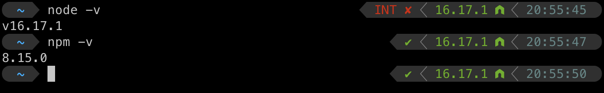
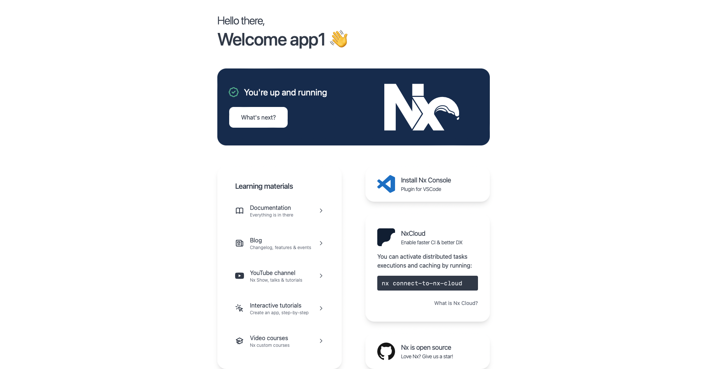

# Day 1: PREPARE THE WORKING ENVIRONMENT

## CODE TOOLS  
there are tons of different text editors, IDE's, console which could be used.   
**I am going to use Intellij Idea**. Feel free having something different:
- Visual Studio
- JetBrains WebStorm
- Notepad++
- Sublime Text
- etc.

## NODEJS
First core thing is to set up NODEJS on your machine.   
`https://nodejs.org/en/download/`
I have at this time Node `v16.17.1`. It could be the same or higher version as NX workspace supports Node versions from 16 and higher

If you need having different NODE version on your local machine I would recommend you [Node version manager(NVM)](https://github.com/nvm-sh/nvm).   

Command to verify your Node version after its installation:

```bash
node -v
npm -v
```

From my machine:   


## ANGULAR CLI
For development of an Angular project, Angular CLI is an essential utility to manage the project from terminal environment. One way to install Angular CLI is to use NPM CLI by running this command line in yours terminal:   
```bash
npm install -g @angular/cli@latest
```   
To check Angular CLI:   
```bash
ng --version
```   

## PROJECT INITIALIZATION
As soon as you are done with the previous steps, run this command to initialize a new Angular application with NX workspace:   
```bash
npx create-nx-workspace@latest
```   
Follow the next steps:   
```bash
Choose your style:                    Integrated: Get a pre-configured setup. Nx configures your favorite frameworks and lets you focus on shipping features.
What to create in the new workspace:  Angular   
Repository name:                      challengular   
Applciation name:                     app1   
Default stylesheet format:            scss   
Enable distributed caching to make your CI faster: NO  
```   

There will be generated `challengular` folder which has such structure:
```bash
challengular/
├── apps/                           -> root folder
│   ├── app1/                         -> application folder
│   │   ├── src/                        -> source folder with code/styles/images
│   │   │   ├── app/                      -> folder with code
│   │   │   ├── assets/                   -> folder for images
│   │   │   ├── environments/             -> contains the base configuration file, which provides a default environment. You can add override defaults for additional environments, such as production, staging, testing in target-specific configuration files.
│   │   │   ├── favicon.ico               -> icon on the browser tab of your application
│   │   │   ├── index.html                -> main view file. In otherwords: entry point
│   │   │   ├── main.ts                   -> project.json and tsconfig.json reference to it and handle for application startup   
│   │   │   ├── polyfills.ts              -> Angular put there few lines of code which make your application compatible for different browsers. The code we write is mostly in ES6(New Features: Overview and Comparison) and is not compatible with IE or firefox and needs some environment setups before being able to be viewed or used in these browsers.
│   │   │   ├── styles.scss               -> app1 styles
│   │   │   └── test-setup.ts             -> Jest setup file
│   │   ├── .browserslistrc             -> it is used by the build system to adjust CSS and JS output to support the specified browsers.
│   │   ├── .eslintrc.json              -> syntax validation tool for app1 folder
│   │   ├── jest.config.ts              -> config file of javascript testing
│   │   ├── project.json                -> it contains information about app1, its scripts and configurartion
│   │   ├── tsconfig.app.json           -> additional config file to tsconfig.json that allows you to adjust your configuration on an app basis
│   │   ├── tsconfig.editor.json        -> new files and files that are not referenced by source files have a tsconfig.editor.json for the type checker in the IDE.
│   │   ├── tsconfig.json               -> compiler config and contains options required to compile the application
│   │   └── tsconfig.spec.json          -> test file for tsconfig.json
│   └── app1-e2e/                     -> that is for testing and we will not go deeply into yet
│       ├── src/                    
│       │   ├── fixtures/           
│       │   │   └── example.json    
│       │   ├── e2e/                
│       │   │   └── app.cy.ts       
│       │   └── support/           
│       │       ├── app.po.ts       
│       │       ├── commands.ts    
│       │       └── e2e.ts         
│       ├── cypress.config.ts       
│       ├── project.json            
│       └── tsconfig.json           
├── libs/                           -> this will contain shared components. More details will be in later instructions
├── node_modules/                   -> generated dependencies taken from package.json and needed for the application
├── tools/                          -> this is where common tooling are included(NO CODE inside). For example: schematics, lint rules, but there can be other things in here to help with automation.
├── .editorconfig                   -> contains a list of rules which can be applied to any IDE or code editors for proper formatting of code
├── .eslintrc.json                  -> global syntax validation for our project
├── .gitignore                      
├── .prettierignore                 -> contains ignored files for checking
├── .prettierrc                     -> codeformatter config
├── decorate-angular-cli.js         -> configuration file to connect NX workspace with our Angular application
├── jest.config.ts                  -> config file of JavaScript Testing Framework with a focus on simplicity.
├── jest.preset.js                  -> presets for your Jest congigurations
├── nx.json                         -> core file of the NX workspace. It collects all info about your application 
├── package.json                    -> core file of the project. It contains scripts which can be run, required dependencies for the project
└── tsconfig.base.json              -> main compiler config and contains options required to compile the application
```   

You can run this command now and open `http://localhost:4200` after the terminal shows the URL to you:
```bash
npx nx serve app1
```

### Congratulations! You successfully have run your first Angular application within Nx workspace 😊


By default, the app runs at port 4200. You can change which port to run the app by using command:
```bash
ng serve --port=other-port-number
```
For instance: `ng serve --port=9000`

The working application is served at the address `http://localhost:4200/`, which can be viewed in your browser.

✅ 1st tutorial is done!   
👋 See you in the 2nd one. 

## HASHTAGS
`angular` `nx` `nx workspace` `frontend` `challenge` `guide` `tutorial`

# AUTHOR
`Serhii Nahornyi`