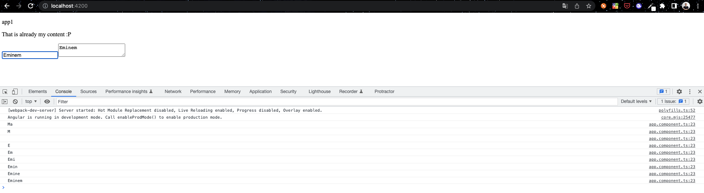

# Day 3: ANGULAR BINDINGS

## BINDINGS
We have tried some bindings in [the 2nd day](day-02.md) of our challenge when we added `content` variable to `app.component.ts` and displayed it in `app.component.html` via `{{ content }}`.

That is called **Angular bindings** in a short form.

### ENVIRONMENT PREPARATION STEP
>Before starting we have to update our `app.module.ts` with Angular module, namely **FormsModule**, to be able to use ngModel in the further steps.   
```typescript
import { NgModule } from '@angular/core';
import { BrowserModule } from '@angular/platform-browser';

import { AppComponent } from './app.component';
import { NxWelcomeComponent } from './nx-welcome.component';
import {FormsModule} from "@angular/forms";                     //add here

@NgModule({
declarations: [AppComponent, NxWelcomeComponent],
imports: [BrowserModule, FormsModule],                          //add here
providers: [],
bootstrap: [AppComponent],
})
export class AppModule {}
```

## ONE-WAY BINDINGS
> It used if we **only need to pass model** to some html element.

for example our `title`. We only want to show it on our page:

```html
<p>{{title}}</p>
```
## TWO-WAY BINDINGS
> It is used if we want to write and read from some html element. 

There are actually two ways to implement `two-way binding` let's try something in our application.
We will create `input` and `textarea` with **readonly**.   

Create a new variable **user** inside `app.component.ts ` with a field **name**.   
```typescript
user = {
    name: "Max"
};
```
As we already know this is only one-way bindings and `textarea` will show us only name "Max" which we set inside `app.component.ts`.    
**It doesn't care if you change your input value, the `textarea` will be the same**.   
>`app.component.html`   
>```html
><input type="text" [ngModel]="user.name"/>
><textarea readonly>{{user.name}}</textarea>
>```

### OLD METHOD (TWO-WAY BINDINGS)
So the `textarea` DOES care about our `input` field if we add `(ngModelChange)="user.name = $event"` to `input` element. What does that do?!
> Basically, it takes the `user.name` variable and listens to this `input` element. Whenever it has some changes the variable will be overwritten and passes to our `textarea`.   

>`app.component.html`
>```html
><input type="text" [ngModel]="user.name" (ngModelChange)="user.name = $event"/>
>```
**(no needs to re-create it on your side, but it presents better for you)** I will create a function with `console.log(user.name)` inside which will log for us every time the `input` field has changes.   
I removed our default value **"Max"** and wrote there **"Eminem"**. As you can see, the changes happened every time whenever letters are added or removed.   


### NEW METHOD (TWO-WAY BINDINGS)
This practice happens more often as the code is shorter and looks better.
>`app.component.html`
>```html
><input type="text" [(ngModel)]="user.name"/>
>```

>`[(ngModel)]` with two brackets replace the whole functionality which was described in the OLD TWO-WAY BINDINGS -> [ngModel]="user.name" and (ngModelChange)="user.name = $event".   

### ATTRIBUTES BINDINGS
We can use **bindings** not only for values as inside the **input field** or as we have it here `<p>{{title}}</p>`.   
The other option is applying it for attributes of elements. Let's create another one example. This time we will take `svg` tag with **Github** logo and will change its color.   
**svg** uses attribute `fill` to fill the icon with a color. So we are going to work with it:   

Add this new variable to your `app.component.ts`:   
```typescript
color = 'black';
```

#### THIS CODE WILL NOT WORK
>`app.component.html`   
>```html
><input type="color" [(ngModel)]="color" name="color"/>
><svg
>fill="{{color}}"
>role="img"
>viewBox="0 0 24 24"
>xmlns="http://www.w3.org/2000/svg"
>style="width: 60px"
>>
><path
>d="M12 .297c-6.63 0-12 5.373-12 12 0 5.303 3.438 9.8 8.205 11.385.6.113.82-.258.82-.577 0-.285-.01-1.04-.015-2.04-3.338.724-4.042-1.61-4.042-1.61C4.422 18.07 3.633 17.7 3.633 17.7c-1.087-.744.084-.729.084-.729 1.205.084 1.838 1.236 1.838 1.236 1.07 1.835 2.809 1.305 3.495.998.108-.776.417-1.305.76-1.605-2.665-.3-5.466-1.332-5.466-5.93 0-1.31.465-2.38 1.235-3.22-.135-.303-.54-1.523.105-3.176 0 0 1.005-.322 3.3 1.23.96-.267 1.98-.399 3-.405 1.02.006 2.04.138 3 .405 2.28-1.552 3.285-1.23 3.285-1.23.645 1.653.24 2.873.12 3.176.765.84 1.23 1.91 1.23 3.22 0 4.61-2.805 5.625-5.475 5.92.42.36.81 1.096.81 2.22 0 1.606-.015 2.896-.015 3.286 0 .315.21.69.825.57C20.565 22.092 24 17.592 24 12.297c0-6.627-5.373-12-12-12"
>/>
></svg>
>```   

> WHY?! So the thing with adding double brackets `{{ }}` is called `INTERPOLATION` and it does not work the same way for attributes!   
> **Working way for `INTERPOLATION`: attr.fill="{{color}}"**    


> It is better to use properly Angular bindings and define our attribute this way `[attr.fill]="color"`.
#### THIS CODE WILL WORK   
>`app.component.html`   
>```html
><input type="color" [(ngModel)]="color" name="color"/>
><svg
>[attr.fill]="color"
>role="img"
>viewBox="0 0 24 24"
>xmlns="http://www.w3.org/2000/svg"
>style="width: 60px"
>>
><path
>d="M12 .297c-6.63 0-12 5.373-12 12 0 5.303 3.438 9.8 8.205 11.385.6.113.82-.258.82-.577 0-.285-.01-1.04-.015-2.04-3.338.724-4.042-1.61-4.042-1.61C4.422 18.07 3.633 17.7 3.633 17.7c-1.087-.744.084-.729.084-.729 1.205.084 1.838 1.236 1.838 1.236 1.07 1.835 2.809 1.305 3.495.998.108-.776.417-1.305.76-1.605-2.665-.3-5.466-1.332-5.466-5.93 0-1.31.465-2.38 1.235-3.22-.135-.303-.54-1.523.105-3.176 0 0 1.005-.322 3.3 1.23.96-.267 1.98-.399 3-.405 1.02.006 2.04.138 3 .405 2.28-1.552 3.285-1.23 3.285-1.23.645 1.653.24 2.873.12 3.176.765.84 1.23 1.91 1.23 3.22 0 4.61-2.805 5.625-5.475 5.92.42.36.81 1.096.81 2.22 0 1.606-.015 2.896-.015 3.286 0 .315.21.69.825.57C20.565 22.092 24 17.592 24 12.297c0-6.627-5.373-12-12-12"
>/>
></svg>
>```


✅ Awesome! You have learned one more topic about Angular and 3rd tutorial is done!   
👋 See you in the 4th one.

## SOURCES
- [Angular bindings detailed [Angular official page]](https://angular.io/guide/binding-overview)

## HASHTAGS
`angular` `nx` `nx workspace` `frontend` `challenge` `guide` `tutorial`

# AUTHOR
`Serhii Nahornyi`