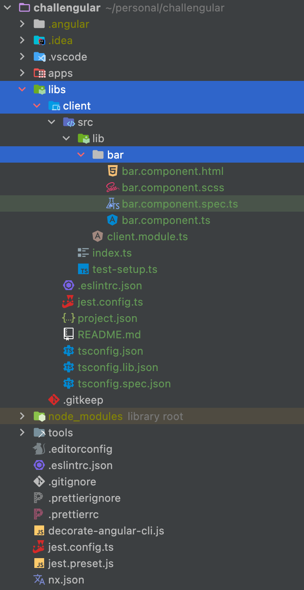

# Day 6: COMPONENTS GENERATION

We have been working with **Angular** inside **NX Workspace** from [1st tutorial](day-1.md).   
Therefore, I will show you options of component generating for **Angular** as well as using **NX Workspace**.    

We are going to prepare a component for the next tutorials. You can select an option for you depends on if you are using **NX Workspace** or not.


## ANGULAR
>```shell
>ng g c bar
>```
>**ng** - Angular prefix, is using to call run Angular commands.   
>**g(generate)** - can be used in both form. I prefer the shorter one. It generates and/or modifies files based on a schematic.   
>**c(component)** - can be used in both form. I prefer the shorter one. It creates a new, generic component definition in the given or default project.   
>**bar** - name of our future component.   

### What can we actually generate within **Angular**?
```shell
ng generate app-shell  //generates an application shell for running a server-side version of an app.
```

```shell
ng generate app [name]  //generates a new basic application definition in the "projects" subfolder of the workspace
```

```shell
ng generate cl [name]  //creates a new, generic class definition in the given or default project.
```

```shell
ng generate d [name]  //creates a new, generic directive definition in the given or default project.
```

**The full list with detailed description of Angular sub-commands can be found here. - [Angular generate sub-commands[Angular Official page]](https://angular.io/cli/generate)**   

## NX WORKSPACE
 
We are going to generate a new component via **NX Workspace** since it has its own project hierarchy to have everything clear 😊   
The commands don't look very differently, namely, there is only some extra prefixes.   

First, let's generate a frontend folder inside `lib`.
>```shell
>npx ng generate lib client
>```
>**npx** - **NX Workspace** prefix, is using to call run commands of **NX Workspace**.   
>**lib** - generates a new library  inside **lib** folder.   
>**client** - a folder name, since it has to be a frontend part.      

> Select Angular library when you get this question.    
> ? Which generator would you like to use?   
> **@nrwl/angular: library**   

We can generate a component inside our frontend library:
```shell
npx ng generate component bar --project=client
```

The whole structure should look like on screenshot below:


✅ Awesome! You have learned about **generating Angular components** and 6th tutorial is done!   
👋 See you in the 7th one.

## SOURCES
- [Angular generate sub-commands[Angular Official page]](https://angular.io/cli/generate)

## HASHTAGS
`angular` `nx` `nx workspace` `frontend` `challenge` `guide` `tutorial`

# AUTHOR
`Serhii Nahornyi`