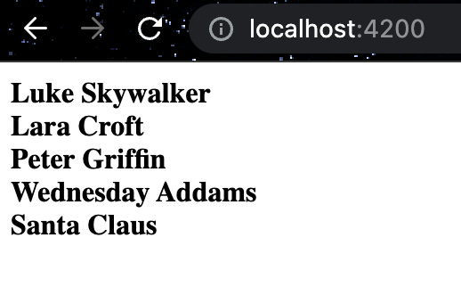
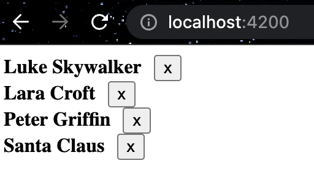

# Day 8: COMPONENT - LISTEN DATA FROM PARENT  WITH OUTPUT BINDING

## Generate components
First, let's create 2 extra components for us:
```shell
npx ng generate c user-list --project=client
npx ng generate c user-detail --project=client
```

## Define data
We will need some data as well to describe the topic more detailed and clear 😊   
Just create a new file `users.ts` inside `user-list` folder with such content:   
<details>
    <summary>Click to see users.ts content</summary>

```typescript
export interface User {
  id: number;
  firstName: string;
  lastName: string;
  email: string;
  gender: string;
}

export const users = [
  {
    id: 1,
    firstName: "Luke",
    lastName: "Skywalker",
    email: "luke.skywalker0@starwars.com",
    gender: "Male"
  },
  {
    id: 2,
    firstName: "Lara",
    lastName: "Croft",
    email: "lara.croft@tombraider.com",
    gender: "Female"
  },
  {
    id: 3,
    firstName: "Peter",
    lastName: "Griffin",
    email: "peter.griffin@familiyguy.com",
    gender: "Male"
  },
  {
    id: 4,
    firstName: "Wednesday",
    lastName: "Addams",
    email: "wendesday.addams@familyaddams.com",
    gender: "Female"
  },
  {
    id: 5,
    firstName: "Santa",
    lastName: "Claus",
    email: "santa.claus@christmas.com",
    gender: "Male"
  }
];
```
</details>

We are going to display the list of users in our application.   
Add a bit content for `user-detail.component.ts` like below. (This is our **Child** component)    
It contains a template how and what we want to display as well as `@Input user` to have this parameter from `user-list.component.ts`.   
```typescript
import {Component, EventEmitter, Input, OnInit, Output} from '@angular/core';
import {User} from "../user-list/users";

@Component({
  selector: 'challengular-user-detail',
  template: `
    <div *ngIf="user">
      <strong>{{ user.firstName }} {{ user.lastName }}</strong>
    </div>
  `,
  styles: [``],
})
export class UserDetailComponent implements OnInit {
  @Input() user: User | undefined; //this parameter will be passed from user-list.component.ts template

  constructor() {}
  ngOnInit() {}

  handleDelete() {
      //the logic will be added later
  }
}
```

`user-list.component.ts`(our **Parent** component) contains ***ngFor** directive to display the user list. It passes each **user** to user-details.component.ts via `[user]="user"`.   
>Be aware of users variable as it is read via "import {User, users} from './users';"   
```typescript
import { Component, OnInit } from '@angular/core';
import {User, users} from './users';

@Component({
  selector: 'challengular-user-list',
  template: `<challengular-user-detail
    *ngFor="let user of users"
    [user]="user"
  ></challengular-user-detail>`,
  styles: [``],
})
export class UserListComponent implements OnInit {
  users = users; //the constant list of users from users.ts will be assigned to variable of this class

  constructor() {}
  ngOnInit(): void {}
}
```
### Result



## Extend with deleteUser method (using @Output decorator)
What about extending our logic with "delete" method? 😁   
Now we are coming to our **@Output** decorator which listens what's going to be passed to a component.   

`user-detail.component.ts` has now **button** **css** tag inside its **template**, which has **(click)** event and a method on it.      
We want to delete a user within `user-detail.component.ts`. We should NOT do it, and probably deleting will not work here.    
It is not allowed to edit/modify/remove the list, since this information is not actually from `user-detail.component.ts` and the list is **constant**.   
But we can send an event to the **parent component**(`user-list.component.ts`) to let us know that we want to remove an element. We will need to use `EvenEmitter` and `@Output` decorator for that.   

```typescript
import {Component, EventEmitter, Input, OnInit, Output} from '@angular/core';
import {User} from "../user-list/users";

@Component({
  selector: 'challengular-user-detail',
  template: `
    <div *ngIf="user">
      <strong>{{ user.firstName }} {{ user.lastName }}</strong>
      <button style="margin-left: 10px" (click)="handleDelete()">x</button>
    </div>
  `,
  styles: [``],
})
export class UserDetailComponent implements OnInit {
  @Input() user: User | undefined; //this parameter will be passed from user-list.component.ts template
  @Output() deleteUser = new EventEmitter<User>(); //this parameter is listened from user-list.component.ts template

  constructor() {}
  ngOnInit() {}

  handleDelete() {
    this.deleteUser.emit(this.user); //trigger the event
  }
}
```

`user-list.component.ts` got a new parameter **(deleteUser)** for `<challengular-user-detail>` selector and **handleDelete(user: User)** function.   
That's how we send a custom event to the component. Now the **parent component**(`user-list.component.ts`) can listen to the above event and interact with it.   

```typescript
import { Component, OnInit } from '@angular/core';
import {User, users} from './users';

@Component({
  selector: 'challengular-user-list',
  template: `<challengular-user-detail
    *ngFor="let user of users"
    [user]="user"
    (deleteUser)="handleDelete($event)"
  ></challengular-user-detail>`,
  styles: [``],
})
export class UserListComponent implements OnInit {
  users = users; //the constant list of users from users.ts will be assigned to variable of this class

  constructor() {}
  ngOnInit(): void {}

  handleDelete(user: User) {
    this.users = this.users.filter((item) => item.id !== user.id);
  }
}
```

### Result



✅ Good job! You have learned how to interact between **Child** and **Parent** components with **@Input** & **@Output** decorators. 8th tutorial is done!   
👋 See you in the 9th one.

## SOURCES
- [Angular Component Interaction[Angular Official page]](https://angular.io/guide/component-interaction)

## HASHTAGS
`angular` `nx` `nx workspace` `frontend` `challenge` `guide` `tutorial`

# AUTHOR
`Serhii Nahornyi`