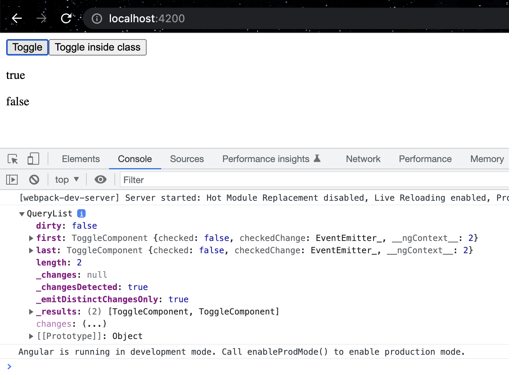

# Day 9: INTRODUCTION WITH VIEWCHILD & VIEWCHILDREN. ACCESS TO DOM ELEMENTS

`@ViewChild` can be used to get the reference of the DOM element rendered inside an Angular component. We can use the reference of the DOM element to manipulate element properties. To get the component, we need to specify the selector.
```typescript
// Accessing DOM element with JavaScript
let domReference = document.getElementById("someElement");

// Access DOM element using Angular @ViewChild
@ViewChild("someElement") domReference;
```

## PREPARATION PART

Generate a new component:
```shell
 npx ng generate c toggle-parent --project=client   
```

Copy `toggle-parent.component.ts`, rename it to `toggle.component.ts` and store to **toggle folder**. So we don't need to generate it.   
> Don't forget to add ToggleParentComponent to **ClientModule.ts** to **Declarations** and **Exports** 
<details>
    <summary>Click to expand ClientModule.ts</summary>

```typescript
import { NgModule } from '@angular/core';
import { CommonModule } from '@angular/common';
import { BarComponent } from './bar/bar.component';
import { UserListComponent } from './user-list/user-list.component';
import { UserDetailComponent } from './user-detail/user-detail.component';
import { ToggleComponent } from './toggle/toggle.component';
import {ToggleParentComponent} from "./toggle/toggle-parent.component";

@NgModule({
  imports: [CommonModule],
  declarations: [
    BarComponent,
    UserListComponent,
    UserDetailComponent,
    ToggleComponent,
    ToggleParentComponent
  ],
  exports: [BarComponent, UserListComponent, ToggleComponent, ToggleParentComponent],
})
export class ClientModule {}

```
</details>

>`app.component.html`
>```html
><challengular-toggle-parent></challengular-toggle-parent>
>```


## @ViewChild USAGE

Let's say we have a **Child** component(`toggle.component.ts`) which has some or one parameter(**checked**) to be passed. Here we are going to make a communication between via **@ChildView**.   
The **Child** component won't have anything new for us from the previous [8th tutorial](day-8.md).
> `toggle.component.ts`
>```typescript
>import {Component, EventEmitter, Input, OnInit, Output} from '@angular/core';
>
>@Component({
>  selector: 'challengular-toggle',
>  template: '<div class="toggle-wrapper" [class.checked]="checked" tabindex="0" (click)="toggle()">\n' +
>    '  <div class="toggle"></div>\n' +
>    '</div>\n' +
>    '\n' +
>    '<p>{{checked}}</p>',
>  styles: [``],
>})
>export class ToggleComponent implements OnInit {
>  @Input() checked = false;
>  @Output() checkedChange = new EventEmitter<boolean>();
>
>  constructor() { }
>
>  ngOnInit() {
>  }
>
>  toggle() {
>    this.checked = !this.checked;
>    this.checkedChange.emit(this.checked);
>  }
>}
>```

The **Parent** component gets some new fields for us and looks like below:

>`toggle-parent.component.ts`
>```typescript
>import {
>Component,
>OnInit,
>QueryList,
>ViewChild,
>ViewChildren
>} from '@angular/core';
>import {ToggleComponent} from "./toggle.component";
>
>@Component({
>   selector: 'challengular-toggle-parent',
>   templateUrl: 'toggle-parent.component.html',
>   styles: [``],
>})
>export class ToggleParentComponent implements OnInit {
>   @ViewChild('toggleComp') toggleComp: ToggleComponent | undefined; //watching a selector with #toggleComp from toggle-parent.component.html
>   @ViewChildren(ToggleComponent) toggleList: QueryList<ToggleComponent> | undefined; //watching all selector of ToggleComponent. e.g. <challengular-toggle>
>
>   ngOnInit() {
>   }
>
>   ngAfterViewInit() {
>       console.log(this.toggleList)
>   }
>
>   toggleInside() {
>       this.toggleList?.last.toggle();
>   }
>}
>```

>`toggle-parent.component.html`
>```html
><button (click)="toggleComp.toggle()">Toggle</button>
><button (click)="toggleInside()">Toggle inside class</button>
>
><br>
><challengular-toggle #toggleComp></challengular-toggle>
>
><challengular-toggle></challengular-toggle>
>
>```

The first button is connected directly to our **ToggleComponent** and to **#toggleComp** via **@ViewChild**.  
The second button calls a method **toggleInside()** from `toggle-parent.component.ts` which calls our **ToggleComponent**.   
- `toggleInside()` takes the list of all found **ToggleComponent**'s selectors and takes the last one since our `toggle-parent.comopnent.html` has 2 **<challengular-toggle>** selectors. That's why the second button triggers the second boolean line.   

## Result



✅ Good job! You have learned about **ViewChild**/ **ViewChildren** decorators and how to handle them. 9th tutorial is done!   
👋 See you in the 10th one.

## SOURCES
- [Angular ViewChild & ViewChildren[Medium page]](https://javascript.plainenglish.io/angular-viewchild-and-viewchildren-fde2d252b9ab)

## HASHTAGS
`angular` `nx` `nx workspace` `frontend` `challenge` `guide` `tutorial`

# AUTHOR
`Serhii Nahornyi`