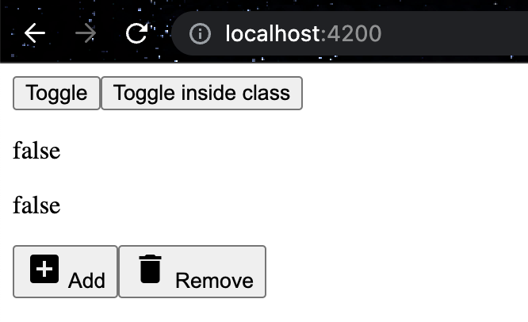

# Day 10: NG-TEMPLATE & NG-CONTAINER?
## NG-TEMPLATE
You have already seen a part of a code in [4th tutorial](day-4.md). We didn't go deep into details and the time has come now 😁   
(always wanted to say this phrase lol)

We were using `*ngIf` directive with `<ng-template>` selector. Otherwise, it wouldn't work for our logic.   

>`app.component.html`
>```html
><div>
> <p>{{color}}</p>
> <ng-container *ngIf="color==='#008000';  then itsGreen; else itsNotGreen">
> </ng-container>
>
>  <ng-template #itsGreen>
>      It's Green!
>  </ng-template>
>
>  <ng-template #itsNotGreen>
>      It's Not Green!
>  </ng-template>
></div>
>```

### DEFINITION
>`ng-template` is one of Angular's elements which defines a template and is not rendered by default.

**Angular says:**
you can define template content that is only being rendered by Angular when you, whether directly or indirectly, specifically instruct it to do so, allowing you to have full control over how and when the content is displayed.

Basically, that what we did with ***ngIf**. We rendered it only when we need a special condition. 

### WHEN TO USE ng-template?
Let save you some time and gain some knowledge a bit from my experience:    
1. Used in conjunction with Angular's Structure Directives, for example*ngIf.   
2. Avoid code duplicates / code re-usage
>before
>```html
><div class="row">
>   <div class="col-4">
>       <p>{{column.title}}</p>
>       <span class="body">something</span>
>   </div>
>   <div class="col-4">
>       <p>{{column.title}}</p>
>       <span class="body">something</span>
>   </div>
>    <div class="col-4">
>       <p>{{column.title}}</p>
>       <span class="body">something</span>
>   </div>
></div>
>```

>after
>```html
><div class="row">
>   <div class="col-4">
>       <ng-container [ngTemplateOutlet]="columnBeginning"></ng-container>.
>   </div>
>   <div class="col-4">
>       <ng-container [ngTemplateOutlet]="columnBeginning"></ng-container>.
>   </div>
>    <div class="col-4">
>       <ng-container [ngTemplateOutlet]="columnBeginning"></ng-container>.
>   </div>
></div>
>
><ng-template #columnBeginning>
>   <p>{{column.title}}</p>
>   <span class="body">something</span>
></ng-template>
>```
## ngTemplateOutlet

>**ngTemplateOutlet** is a powerful tool for creating customisable components. It provides for us custom templates.   

Let's say I want to have a couple buttons with different **names**, **classes** and probably **icons** or **images**. How would I do it?

Here is a way of using `ng-template` and `ng-container`:
>
> ```html
>   <ng-template
>       #buttonTemplate
>       let-label="label"
>       let-className="className"
>       let-icon="icon">
>       <button [ngClass]="['btn', className ? className : '']">
>           <i *ngIf="icon" class="material-icons">{{icon}}</i>
>               {{ label }}
>       </button>
>   </ng-template>
>
>   <ng-container
>       [ngTemplateOutlet]="buttonTemplate"
>       [ngTemplateOutletContext]="{ label: 'Add', className: 'btn-add', icon: 'add_box' }">
>   </ng-container>
>
>   <ng-container
>       [ngTemplateOutlet]="buttonTemplate"
>       [ngTemplateOutletContext]="{ label: 'Remove', className: 'btn-remove', icon: 'delete' }">
>   </ng-container>
> ```

Result:   

 
We have created a button template with `ng-template` and it has multiple parameters like: **let-label**, **let-className**, **let-icon**.   
The parameters will be passed inside `ng-containers` with its own names. That is a way how we can re-use our **template** for different buttons.   


✅ Great job! You have learned about **ng-template** & **ng-container** directives and how to handle them. 10th tutorial is done!   
👋 See you in the 11th one.

## SOURCES
- [Angular using ng-container[Medium page]](https://javascript.plainenglish.io/angular-ng-container-must-learn-for-developers-2aba04e7661b)
- [Angular using ngTemplateOutletContext[Indepth.dev]](https://indepth.dev/posts/1405/ngtemplateoutlet)

## HASHTAGS
`angular` `nx` `nx workspace` `frontend` `challenge` `guide` `tutorial`

# AUTHOR
`Serhii Nahornyi`