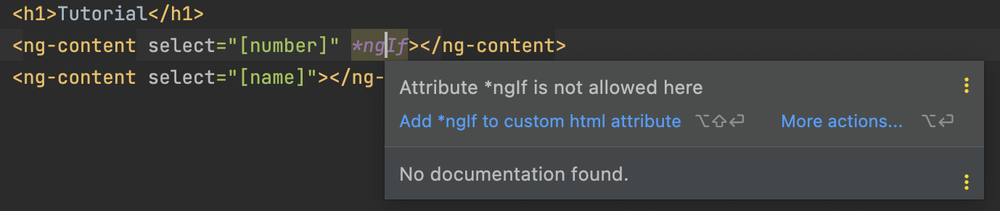

# Day 11: Content Projection with ng-content
## What is Content Projection?
>Content projection is basically a way to reuse component content in Angular that is more generic in scope than passing data or content from parent to child component or vice versa.

>This is important for making sure we do not repeat ourselves and that our code is both flexible and reusable.

Example: if we have **TitleComponent** and you need to use `<h2>` tag instead of `<h1>` or `<p>`.

## Single-slot Content Projection
>a component accepts content from a single source

I will create a new component TitleComponent for our next example:   
```shell
npx ng generate component title --project=client
```

I want to have this time 2 columns:   
>`app.component.html`
>```html
><div style="display: flex">
>  <!-- Col-1 -->
>  <div style="flex: 50%">
>    Tutorial 10
>  </div>
>
>  <!-- Col-2 -->
>  <div style="flex: 50%">
>    Tutorial 11
>  </div>
></div>
>```

Each column has a title right? And the styles for the titles are the same. There are many reasons to use different styles but let keep the same style 😊       
To avoid the code duplicates we are going to use our `<ng-content>`   
>`title.component.html`
>```html
><div class="title">
>  <h1>Tutorial</h1>
>  <ng-content></ng-content>
></div>
>```

>`app.component.html`
>```html
><div style="display: flex">
>  <!-- Col-1 -->
>  <div style="flex: 50%">
>    <challengular-title>
>      <h1>10</h1>
>      <h2>Content Projection</h2>
>    </challengular-title>
>  </div>
>
>  <!-- Col-2 -->
>  <div style="flex: 50%">
>    <challengular-title>
>      <h1>11</h1>
>      <h2>Coffee making</h2>
>    </challengular-title>
>  </div>
></div>
>```

Result:   


>But why should we use <ng-content> ?! What if I don't use it in my component and just put my tags inside?

Answer is -> custom changes won't be displayed 😋   


## Multi-slot Content Projection
>a component accepts content from multiple sources

This type uses **selectors** for any combination of tag name, attribute, class. Let's modify our `TitleComponent`.   
>`title.component.html`
>```
><div class="title">
>  <h1>Tutorial</h1>
>
><ng-content select="[number]"></ng-content>
><ng-content select="[name]"></ng-content>
></div>
>
>```

>`app.component.html`
>```html
><div style="display: flex">
>  <!-- Col-1 -->
>  <div style="flex: 50%">
>    <challengular-title>
>      <h1 number>10</h1>
>      <h2 name>Content Projection</h2>
>    </challengular-title>
>  </div>
>
>  <!-- Col-2 -->
>  <div style="flex: 50%">
>    <challengular-title>
>      <h1>11</h1>
>      <h2>Coffee making</h2>
>    </challengular-title>
>  </div>
></div>
>```

Result:   


What do we have now? We have created kind of a schema which should be applied to our `TitleComponent` and the second title won't be displayed. Try to remove any of these selectors 🙂  

## Conditional Content Projection
>components that use conditional content projection render content only when specific conditions are met

This type requires a wrapper if we want to use `*ngIf` directive.   
The first idea could be to add `*ngIf` to `ng-content` right? Here is what we will get:     


>The right way to implement it is using `ng-container` before! Example below   

>`title.component.html`
> ```
> <div class="title">
> <ng-container *ngIf="isExists">
>   <h1>Tutorial</h1>
>   <ng-content select="[number]"></ng-content>
>   <ng-content select="[name]"></ng-content>
> </ng-container>
>
> <ng-container *ngIf="!isExists">
>   <h1>Tutorial</h1>
>   <ng-content select="[number]"></ng-content>
>   <ng-content select="[name]"></ng-content>
> </ng-container>
> </div>
> ```

>`title.component.ts`
> ```typescript
> import {Component, Input, OnInit} from '@angular/core';
>
> @Component({
> selector: 'challengular-title',
> templateUrl: './title.component.html',
> styleUrls: ['./title.component.scss'],
> })
> export class TitleComponent implements OnInit {
> @Input() isExists: any;
>
> constructor() {}
> ngOnInit(): void {}
> }
> ```

>`app.component.html`
>```html
><div style="display: flex">
>  <!-- Col-1 -->
>  <div style="flex: 50%">
>    <challengular-title [isExists]="true">
>      <h1 number>10</h1>
>      <h2 name>Content Projection</h2>
>    </challengular-title>
>  </div>
>
>  <!-- Col-2 -->
>  <div style="flex: 50%">
>    <challengular-title [isExists]="false">
>      <h1>11</h1>
>      <h2>Coffee making</h2>
>    </challengular-title>
>  </div>
></div>
>```   
Result:   


In our case ***ngIf** works for `<ng-content>` as you can see it from the screenshot as the word "Tutorial" is outside of `<ng-content>`.   

✅ Great job! You have learned about **ng-content** and its types. 11th tutorial is done!   
👋 See you in the 12th one.

## SOURCES
- [Angular content projection[Angular page]](https://angular.io/guide/content-projection)

## HASHTAGS
`angular` `nx` `nx workspace` `frontend` `challenge` `guide` `tutorial`

# AUTHOR
`Serhii Nahornyi`