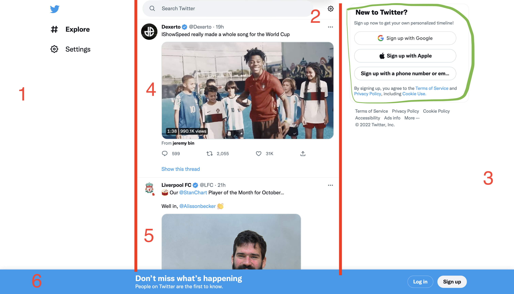
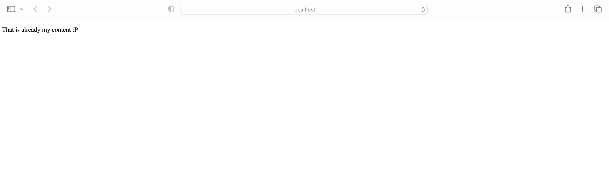
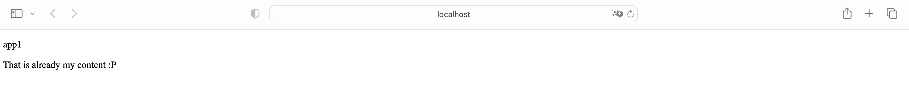

# Day 2: CHECK WHAT IS INSIDE

## WEB STRUCTURE OVERVIEW ON TWITTER'S EXAMPLE
We are going to work with `apps/src/app/` and `libs/` folders most of the time.   
- `apps/src/app/` contains the entry points or main files of our application which will communicate with `libs/`.   
- `libs/` will contain or share components, views, controllers which will be in touch with `apps/src/app/`.   

Let me show you an example from `Twitter` below what I mean and what current web apps look like.
   

As you can see we have the whole website which could be located `apps/src/app/app.component.html` and some categories beside that.   
That is uncomfortable and can't be good maintained if the whole website will be implemented only in one file. And that's why we have `libs/`.   

We have there 3 zones or columns: left, middle and right with numbers 1,2,3 consequently. They might have their own components in `libs/` for example `left.component.html`, `middle.component.html` and `right.component.html`.   
These 3 columns are divided inside on smaller parts as well as you can see numbers 4,5 and the green lined box inside the 3rd column. Beside that there is a footer with the number 6.    
Why do we really need to keep it outside our html file in somewhere else?!   

Well, let's take a look on the number 4 and 5. They are actually the same and just reused in the code. Since the main idea of Twitter is working with posts from people.   
So we can have something like `tweet.component.html` and `tweet.component.ts` which are responsible for the view and logic of posts. And the good part is that we can just reuse the same code as there are millions if not billions of tweets 😁   

The same happens for the footer. We want to show it on every page but it is not implemented everywhere. We could have something like `footer.component.html` and add it to our main page.   
- it will not destroy our css styles and layout of the page.
- we do not need to adapt every application page for that.
- it is reusable and can be good maintained.
- code is clear and readable. 

## DISCOVER THE APPLICATION
### APP.COMPONENT.HTML - OUR VIEW
`app.component.html` links to a different component which contains the whole page content:   
```html
<challengular-nx-welcome></challengular-nx-welcome>
```

Let's check what happens if `app.component.html` looks like below:   
```html
<!-- <challengular-nx-welcome></challengular-nx-welcome> -->
<p>That is already my content :P</p>
```

You should have such a view now under `http://localhost:4200`:


### APP.COMPONENT.TS - OUR LOGIC
`app.component.ts` is a logic of our application.
```typescript
import { Component } from '@angular/core';          //module imports

@Component({                                        //this annotation marks our class as Component to let Angular know about it
selector: 'challengular-root',                      //it is used inside html files to link to that component
templateUrl: './app.component.html',                //template or view of this component
styleUrls: ['./app.component.scss'],                //styles of this component
})
export class AppComponent {
title = 'app1';
}
```   

Let's make some changes to integrate the component into our `app.component.html`.   
```typescript
import { Component } from '@angular/core';

@Component({
  selector: 'challengular-root',
  templateUrl: './app.component.html',
  styleUrls: ['./app.component.scss'],
})
export class AppComponent {
  title = 'app1';
  content = 'That is already my content :P';
}
```

and now adapt our `app.component.html`:
```html
<!-- <challengular-nx-welcome></challengular-nx-welcome> -->
<p>{{title}}</p>
<p>{{content}}</p>
```

We have included variables from our component to our view. That's much comfortable if we have to reuse some words again and again or separate by having only layout in `.html` files and content, code in `.ts`.   



### APP.MODULE.TS - OUR MODULE CONFIGURATIONS
> `app.component.html` and `app.component.ts` can not be found by Angular if they are not included in a `module.ts` file   

>Here is `module.ts` structure:
```typescript
import { NgModule } from '@angular/core';                       //needed imporst for Angular
import { BrowserModule } from '@angular/platform-browser';      //needed imporst for Angular

import { AppComponent } from './app.component';                 //our component
import { NxWelcomeComponent } from './nx-welcome.component';    //our welcome component from Nx workspace

@NgModule({                                                     //this annotation declares our class as module for Angular
    declarations: [AppComponent, NxWelcomeComponent],           //lists of components, directives and pipes which belongs to this module
    imports: [BrowserModule],                                   //other modules whose exported classes are needed by component templates
    providers: [],                                              //lists of components which become accessible in all parts of the application
    bootstrap: [AppComponent],                                  //the main application view, called the root component, which hosts all other application views. Only the root NgModule should set the bootstrap property.
})
export class AppModule {}
```

### EXTRA TASK FOR THE END
As you might notice we have some default generated welcome component from NX workspace which we don't need to use anymore.   
>The task is - to remove NXWelcomeComponent and its usages from our project 😁


✅ 2nd tutorial is done!   
👋 See you in the 3rd one.

## HASHTAGS
`angular` `nx` `nx workspace` `frontend` `challenge` `guide` `tutorial`

# AUTHOR
`Serhii Nahornyi`