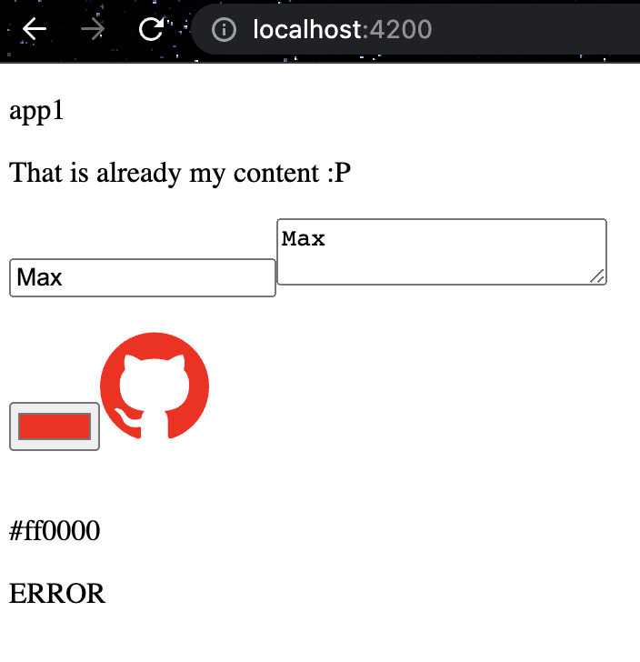
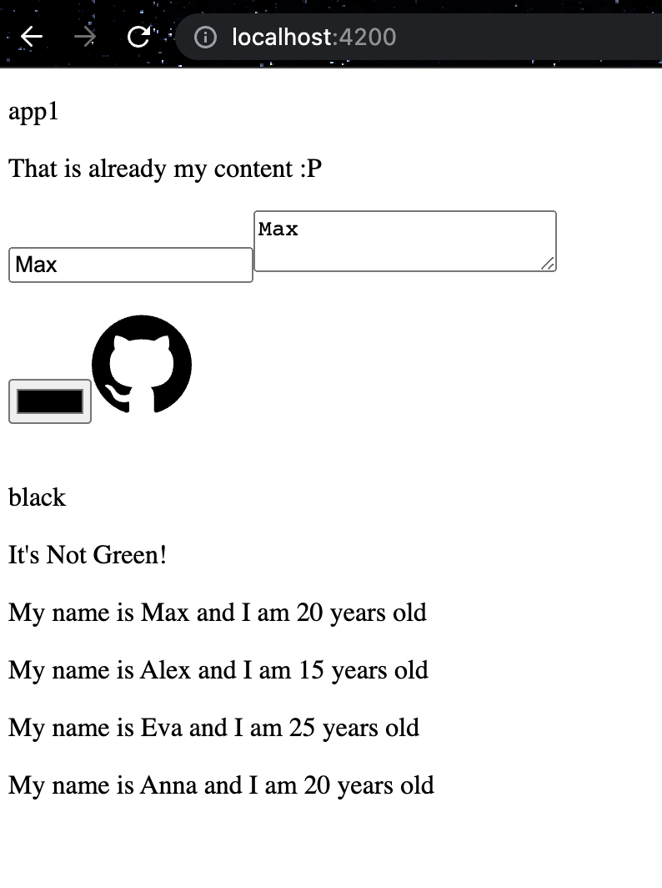
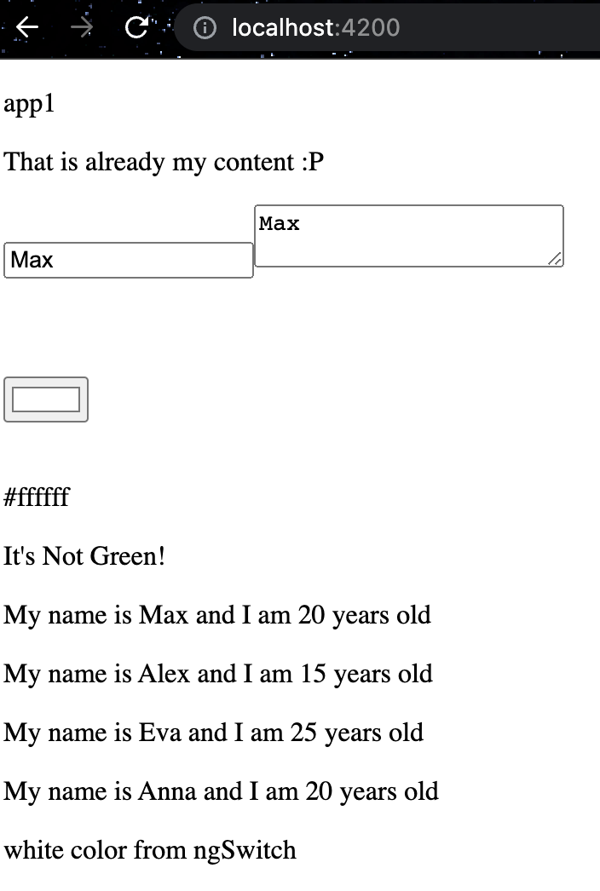

# Day 4: ANGULAR BUILT-IN STRUCTURAL DIRECTIVES(ngIf, ngFor, ngSwitch)
Angular provides by default some structural directives which can, and most of the time, will be used.   
Reasons for it?   
- easy
- comfortable
- less code/logic

Let's check what exactly Angular says:      
>Structural directives are responsible for HTML layout. They shape or reshape the DOM's structure, typically by adding, removing, and manipulating the host elements to which they are attached.

## ngIf
>Short form: it does something with "if" condition. E.g. a button will be shown if user is logged in.   
>When "NgIf" is false, Angular removes an element and its descendants from the DOM. Angular then disposes of their components, which frees up memory and resources.

Let's reuse our color selection which we have added in the [previous 3rd tutorial](day-3.md).   
I want to see `SUCCESS` as text when color will be `green(#008000)` or `ERROR` if it is `red(#ff0000)`.   
>`app.component.html`
>```html
><div>
>  <p>{{color}}</p>
>  <p *ngIf="color==='#008000'">SUCCESS</p>
>  <p *ngIf="color==='#ff0000'">ERROR</p>
></div>
>```

   

## ngIF + else
What if we want to show `SUCCESS` only for 1 color and for any other `ERROR` ?   
Text `ERROR` will be displayed for any color except this `green(#008000)`.     
>Important to use <ng-template> which will have #other_content   

>`app.component.html`
>```html
><div>
>  <p>{{color}}</p>
>  <p *ngIf="color==='#008000';else other_content">SUCCESS</p>
>  <ng-template #other_content>ERROR</ng-template>
></div>
>```   

## ngIF + then + else   
Here is a different way of `ngIf` which you might see in projects.   
>`app.component.html`
>```html
><div>
>  <p>{{color}}</p>
>  <ng-container *ngIf="color==='#008000';  then itsGreen; else itsNotGreen">
>  </ng-container>
>
>   <ng-template #itsGreen>
>       It's Green!
>   </ng-template>
>
>   <ng-template #itsNotGreen>
>       It's Not Green!
>   </ng-template>
></div>
>```   

## ngFor
>Use `NgFor` directive to present a list of items.      

Let's create a new array variable with `user` object inside and display it.  

>`app.component.ts`
>```typescript
>  users = [
>    {
>      name: "Max",
>      age: "20"
>    },
>    {
>      name: "Alex",
>      age: "15"
>    },
>    {
>      name: "Eva",
>      age: "25"
>    },
>    {
>      name: "Anna",
>      age: "20"
>    }
>];
>```
>`app.component.html`
>```html
><div>
>  <div *ngFor="let user of users">
>    <p>My name is {{user.name}} and I am {{user.age}} years old</p>
>  </div>
></div>
>```  
   

## ngSwitch
>Like the JavaScript switch statement, NgSwitch displays one element from among several possible elements, based on a switch condition. Angular puts only the selected element into the DOM.   

>`app.component.html`
>```html
><div [ngSwitch]="color">
>  <div  *ngSwitchCase="'#000000'">black color from ngSwitch</div>
>  <div  *ngSwitchCase="'#ffffff'">white color from ngSwitch</div>
>  <div  *ngSwitchDefault>something else?</div>
></div>
>```     




✅ Great! You have learned one more topic about Angular and 4th tutorial is done!   
👋 See you in the 5th one.

## SOURCES
- [Angular built-in structural directives [Angular official page]](https://angular.io/guide/built-in-directives#built-in-structural-directives)

## HASHTAGS
`angular` `nx` `nx workspace` `frontend` `challenge` `guide` `tutorial`

# AUTHOR
`Serhii Nahornyi`