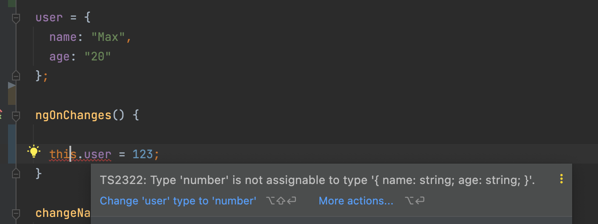

# Day 5: TYPESCRIPT DATA TYPES
We have been working with some variables like `color` or `user` the previous 4 tutorials and didn't use any type yet.   
Let's talk about it a bit.   

Let's check what exactly Angular says:      
>Structural directives are responsible for HTML layout. They shape or reshape the DOM's structure, typically by adding, removing, and manipulating the host elements to which they are attached.

## TypeScript == Javascript ?
>NO!   
>TypeScript shares the same base syntax as JavaScript, but adds something to it extra, namely, static typing.

I won't tell you more detailed about it as this tutorial is not Wikipedia or lessons in a university 😁   
As you might know Javascript is a dynamic language. It allows you to use the same variable literally for everything.
```javascript
let user = 'Max';
user = 123;
user = true;
```

>This example could be comfortable but in the reality it makes huuuuuge problems during debugging or searching for problems inside the code.    

I will try to do the same but in our `AppComponent`. Look what we got:   

>Type "number" is not assignable to type {name: string, age: string}.   

So, Typescript(TS) verified the first assigned values to our `user` variable and shows the compilation error to us.   

## Typescript types
```typescript
let someString: string;
let someNumber: number;
let someBoolean: boolean;
let something: any; // this could be literally everything as Javascript does
let someStringArray: string[]; // could be also different arrays: number[], boolean[], any[]
let someObject: object;
let someNull: null;
let someUndefined: undefined;
let someUnknown: unknown;
let someNever: never; // for example a function that throws exception
let someTuple: [string, number];
let someVoidFunction: () => void; // a function that returns nothing after execution
```

## Typescript interfaces
```typescript
interface User {
    firstName: string;
    lastName: string;
    age?: number;
}

const max: User = {
    firstName: 'Max',
    lastName: 'Mustermann',
    age: 20,
};

const alex: User = {
    firstName: 'Alex',
    lastName: 'Anderson'
};
```

In the above code, we declare a User interface that includes `firstName`, `lastName` and `age`.   
That means, every variable which has this interface should have these fields defined.   

>But, please notice the `age?: number`. This is called Optional Property. This property is non-required and user can decide if he wants to share his age with us   

Using the interface will help the text editor to suggest what properties your object has on that object. When type `max`, the text editor will suggest: `firstName`, `lastName` and `age` to choose when accessing. This minimizes typos when you write code.

## Typescript classes
**TS** brings top class support with a powerful **typings** system. To better understand the **class**, you need to have knowledge of **Object Oriented Programming(OOP)**.   
Here, we will only explore the syntax of using classes in TS.   

```typescript
class User {
    firstName: string;
    lastName: string;
    age?: number;

    constructor(firstName: string, lastName: string, age?: number) {
        this.firstName = firstName;
        this.lastName = lastName;
        this.age = age;
    }
}
```

TS also supports Access Modifier for classes with keywords like: `public`, `private`, and `protected`. In combination with Access Modifiers, you can declare the User class with the following brief syntax:   
```typescript
class User {
    constructor(
        public firstName: string,
        public lastName: string,
        public age?: number,
    ) {}
}
```

### What should I use? Class or Interface?
Simply **Class** is to create objects and **Interface** assists you what these objects should contain.   

>Interfaces
> - Describe how an object should look   
> - Exists compile time only, with the sole purpose of type checking

>Classes
> - It's like a blueprint/template from which we can create objects
> - It can implement an interface which means it has to implement at least all properties/methods from the interface.

```typescript
interface User {
    firstName: string;
    lastName: string;
    tellAboutYourHobby: () => void;
}

// if we want to implement from User interface 
// You have to define all required properties, functions which are located on the person interface
class Doctor implements User {
    constructor(public firstName: string, public lastName: string){}

    tellAboutYourHobby () {
        console.log('skiing, reading books')
    }
}
```

## Typescript generics
Generics allow creating 'type variables' which can be used to create classes, functions & type aliases that don't need to explicitly define the types that they use.
>Generics make it easier to write reusable code.

Let's check the example below:   
```typescript
abstract class CarFactory<T> {
  protected carModel: Model<T>;

  find(): T[] {
    return this.car.findAll();
  }

  findOne(modelName: string): T {
    return this.model.findByModelName(modelName);
  }
}
```
The `<T>` syntax is `Generics`, in other words, Type Parameter.

We have an abstract class `CarFactory` and the thing is, there are so many car **types**, **models**, right?      
Someone likes sportcars, others sedans, someone likes jeeps and so on.   
We can extend this abstract class for different types or models and just reuse the code. Let me show how:

```typescript
class SportcarFactory extends CarFactory<SportCar> {
  constructor(sportCarModel: Model<SportCar>) {
    super();
    this.carModel = sportCarModel;
  }
}

class CabrioFactory extends CarFactory<Cat> {
  constructor(cabrioModel: Model<SportCar>) {
    super();
    this.carModel = cabrioModel;
  }
}
```

Let's create a simple example with a function now. 
```typescript
function createPair<S, T>(v1: S, v2: T): [S, T] {
    return [v1, v2];
}
console.log(createPair<string, number>('hello', 42)); // ['hello', 42]
console.log(createPair<number, boolean>(12, true)); // [12, true]
console.log(createPair<any, number[]>('whatever type', [1,2,3])); // ['whatever type', [1,2,3]]
```

There is createPair() function which has `S` and `T` as **Generics**. Which means we could put there a needed for us type and pass any parameters.   
It makes the code more reusable and at the same time strict, clear and easy readable.


✅ Great! You have learned about **TS** types and 5th tutorial is done!   
👋 See you in the 6th one.

## SOURCES
- [TS Generics [Typescript official page]](https://www.typescriptlang.org/docs/handbook/2/generics.html)

## HASHTAGS
`angular` `nx` `nx workspace` `frontend` `challenge` `guide` `tutorial`

# AUTHOR
`Serhii Nahornyi`